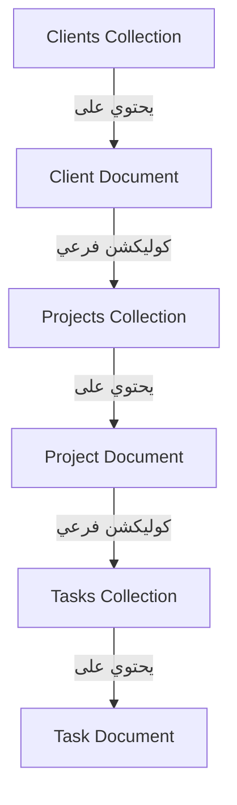

# 🚀 خطة بناء نظام إدارة أعمالي وعملائي (islam.walied) — محدث ومكتمل بالكامل

هذه هي الوثيقة المرجعية الرسمية والخطة التنفيذية لنظام إدارة العملاء والمشاريع والمهام (islam.walied v2.0). تم بناء النظام بالكامل كلوحة تحكم ذكية تعمل كصفحة واحدة (SPA) بدون ريفريش، بتصميم فخم وراقي مستوحى من ألوان ومود ثيم **PhpStorm New Dark UI Theme**، ومدمج بالكامل مع الباك-إند وقاعدة البيانات اللحظية من Firebase.

---

## 🎨 الهوية البصرية ونظام التصميم (CSS Design System)

تم توحيد درجات الألوان والأبعاد البرمجية في متغيرات الـ CSS لمنح تجربة مستخدم مريحة للغاية للعين ومطابقة للـ IDEs الاحترافية:

*   **خلفية التطبيق الأساسية (`#1E1F22`):** الرمادي الداكن العميق للخلفية الكاملة.
*   **خلفية القوائم والأعمدة والكروت (`#2B2D31`):** خلفية كروت العملاء والمشاريع وأعمدة الكانبان.
*   **خلفية الكروت النشطة والحقول الداكنة (`#1E1F22`):** لمنح العمق والتباين البصري.
*   **الخطوط الأساسية (`#DFE1E5`):** أبيض هادئ مائل للرمادي لراحة العين أثناء الاستخدام الطويل.
*   **الخطوط الفرعية والتفاصيل (`#9399A5`):** الرمادي الباهت لعرض التاريخ، والوصف، وإحصائيات الكانبان.
*   **اللون التفاعلي والأزرار والتحديد (`#3574F0`):** الأزرق الصريح والحيوي لـ PhpStorm.
*   **ألوان الحالات والمهام:**
    *   🔵 المطلوب (Todo): `#3574F0`
    *   🟡 جاري التنفيذ (Doing): `#F0A835`
    *   🟢 تم الانتهاء (Done): `#3DB981`
*   **ألوان التحذير والأمان (`#E05C5C`):** لون أحمر فاخر وهادئ لعمليات الحذف وزر تسجيل الخروج.
*   **أبعاد القائمة الجانبية (Sidebar):** تم توسيع العرض ديناميكياً إلى `260px` لمنع تداخل الكلمات واستيعاب الأسماء الطويلة وتنسيقها باتجاه اليمين (RTL) بشكل مثالي فخم.

---

## 🏗️ البنية المعمارية للملفات والداتابيز (System Architecture)

### 📂 ملفات المشروع الحالية:
*   [index.html](file:///d:/IslamLifeV2/index.html) - الهيكل العام للـ SPA والـ Modals وحاويات العرض.
*   [style.css](file:///d:/IslamLifeV2/style.css) - نظام التصميم الشامل، الـ Responsiveness، وتأثيرات الحركات والتفاعل.
*   [app.js](file:///d:/IslamLifeV2/app.js) - عصب التطبيق (التحكم بالصفحات، السحب والإفلات، عمليات الإضافة والتعديل والحذف، وربط Firebase).
*   [firebase-config.js](file:///d:/IslamLifeV2/firebase-config.js) - إعدادات الاتصال وحماية الدخول المخصصة للمدير.

### 📊 هيكل البيانات اللحظي (Firebase Firestore Schema):
تم بناء نظام هرمي متدرج يعتمد على الـ Subcollections لضمان استقرار المهام وارتباطها المباشر بمشاريعها وعملائها:

---

## 🛠️ جدول مراحل التنفيذ وما تم تحقيقه على أرض الواقع

### 🗓️ المرحلة الأولى: الهيكل العام والتصميم الفخم (مكتملة 100%)
*   [x] إنشاء هيكل التطبيق والصفحة الواحدة (SPA) في `index.html`.
*   [x] تصميم وضبط متغيرات الألوان المتطابقة مع ثيم PhpStorm New Dark في `style.css`.
*   [x] بناء القائمة الجانبية (Sidebar) بعرض `260px` يدعم الطي الذكي (Collapse) مع دوران أيقونة السهم CSS 3D وحفظ خيار المستخدم في الـ `localStorage`.
*   [x] ضبط محاذاة القائمة الجانبية لليمين بشكل احترافي بالكامل (RTL) ووضع مؤشر الصفحة النشطة في اليمين بدلاً من اليسار.

### 🔗 المرحلة الثانية: ربط الباك-إند والأمان الفائق (مكتملة 100%)
*   [x] تهيئة وتفعيل Firebase Firestore كقاعدة بيانات سحابية لحظية.
*   [x] تفعيل الـ Google Authentication لتسجيل الدخول الفوري عبر النوافذ المنبثقة.
*   [x] **نظام حماية مخصص**: قصر الوصول للنظام على البريد الإلكتروني المسموح به للمدير (`allowedEmail`) فقط، وطرد أي حساب آخر تلقائياً مع تنبيه تحذيري فخم.
*   [x] برمجة مؤشر ذكي لحالة الاتصال بالداتابيز (`#db-dot` و `#db-status-text`) في أسفل القائمة الجانبية ينبض باللون الأخضر عند الاتصال واللون الأحمر مع فقدان الاتصال.

### 🔄 المرحلة الثالثة: نظام التصفح والعمليات (Realtime CRUD) (مكتملة 100%)
*   [x] ربط مستمعات التغيرات اللحظية (`onSnapshot`) لتحديث البيانات فوراً وبسلاسة عبر الأجهزة دون الحاجة لعمل ريفريش.
*   [x] بناء نظام تصفح ديناميكي بالكامل بين المستويات:
    *   **العملاء (Clients)**: عرض الكروت مع آيركونات ومؤثرات حركية، وإمكانية الإضافة والتعديل والحذف الآمن مع نافذة تأكيد تحذيرية حمراء لمنع الحذف بالخطأ.
    *   **المشاريع (Projects)**: الدخول التلقائي عند الضغط على كرت العميل، وعرض المشاريع بحالات ملونة (نشط / متوقف مؤقتاً / مكتمل).
    *   **المهام (Tasks - Kanban)**: الدخول لمشروع محدد لفتح لوحة الكانبان بثلاثة أعمدة تفاعلية مع حماية عالية للمهام.
*   [x] إضافة أزرار رجوع ذكية (`toolbar-back-btn`) مع محاذاة وسهم مرن يدعم الـ RTL لنقل المستخدم بسلاسة (المهام ← المشاريع ← العملاء).
*   [x] دمج الـ Forms في نافذة Modal ديناميكية موحدة فائقة السرعة تتعرف على نوع العملية والبيانات تلقائياً.

### 🫳 المرحلة الرابعة: السحب والإفلات وإعادة الترتيب المتقدمة (Drag & Drop) (مكتملة 100%)
*   [x] **إعادة ترتيب العملاء والمشاريع**: دعم سحب كرت العميل أو المشروع وإفلاته فوق كرت آخر لتغيير ترتيبهم يدوياً فورا مع حفظ الترتيب الجديد في Firestore (حقل `order`) وإعادة رسم الشاشة بسلاسة فائقة.
*   [x] **إعادة ترتيب ونقل المهام في الكانبان**:
    *   سحب كرت المهمة وإفلاته بين الأعمدة (المطلوب ← جاري التنفيذ ← تم الانتهاء) لتحديث حالة المهمة فوراً في قاعدة البيانات.
    *   دعم سحب وإعادة ترتيب المهام رأسياً داخل نفس العمود لترتيب الأولويات يدوياً.
*   [x] إضافة تأثيرات بصرية فخمة للغاية أثناء السحب (شفافية الكرت المسحوب، توهج العمود أو الكرت المستقبل بحدود زرقاء مضيئة `drag-over` و `drag-over-card` لتجربة UX لا مثيل لها).

### 🔍 المرحلة الخامسة: تحسينات الـ UX والتفاصيل البريميوم (مكتملة 100%)
*   [x] **أزرار البحث الذكية (Expandable Search)**: تحويل جميع أزرار البحث إلى أيقونات بحث تفاعلية تتمدد بسلاسة لتكشف عن صندوق إدخال RTL عند الضغط عليها، وتتقلص تلقائياً عند فقدان التركيز.
*   [x] **الـ Quick Add الفوري**: إضافة نموذج سريع ومبسط داخل عمود "المطلوب" مباشرة يتيح للمستخدم إضافة مهمة بضغطة زر أو زر Enter دون الحاجة لفتح الـ Modal، مع تفعيل تأثير الاهتزاز (Shake) في حال محاولة الإرسال الفارغ.
*   [x] **تنبيهات الـ Toasts المتفاعلة**: نظام إشعارات مرن يظهر أسفل يمين الشاشة بحركات جذابة وألوان متطابقة مع نوع النتيجة (نجاح العملية ✅ / فشل ❌ / إرشاد 👋) لتأكيد التفاعلات مع المستخدم.
*   [x] **نقل زر تسجيل الخروج للأسفل**: نقل زر تسجيل الخروج بالكامل إلى أسفل القائمة الجانبية مدمجاً بشكل رائع داخل الـ Footer الفخم، وتلوينه بلون أحمر ناعم وفاخر مع تفعيل تحوله الدائري الذكي عند طي القائمة.
*   [x] **لوحة تحكم تنفيذية ومستقلة وقابلة للطي (Executive Dashboard v3.2)**: تقسيم الصفحة الرئيسية باستخدام CSS Grid إلى مساحة عمل ثنائية (65% للمشاريع الجارية، و35% للإنتاجية والأنشطة). يتم تصفية المشاريع لعرض الجارية فقط (Active-Only Filter) بشكل شريطي متناهي الصغر (ارتفاع صارم 42px) مدمج به اسم المشروع والعميل في سطر واحد وشريط تقدم خطي دقيق (Micro-Bar 3px) أسفل الصف مباشرة. تم تحويل القسم إلى عنصر ذكي قابل للطي والفتح (Collapsible Panel) وحفظ حالة الفتح/الطي في الـ `localStorage` لتوفير مساحة التركيز.

---

## 🔮 خطة التوسع المستقبلي والتطوير (Future Scale)

النظام مهيأ برمجياً ومعمارياً لدمج التبويبات الثلاثة القادمة (المصاريف 💰، التغذية 🥗، التمرين 🏋️) بنفس الكفاءة دون أي ريفريش:
1.  **برمجة الكود المستقل**: تخصيص موديولات برمجية منفصلة لكل تبويب (مثل `meals.js` أو `workout.js`).
2.  **توسيع هيكل البيانات**: إضافة كوليكشنز رئيسية مستقلة على Firebase مرتبطة بحساب المسؤول.
3.  **العرض المشروط في الـ SPA**: تفعيل التبديل التلقائي بين سكاشن التبويبات عبر الـ JS بإضافة التبويبات في الـ Sidebar وإخفاء/إظهار المحتوى التابع لها ديناميكياً بمرونة تامة.